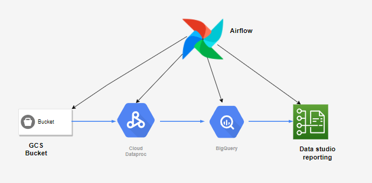

# Google-cloud-batch-process-ETL-pipeline-with-BI-Reporting

*This repository describes to learn a end to end batch process pipeline using google cloud using GCS bucket, dataproc cluster, bigquery, Google data studio as BI tool for reporting with full automation using airflow*

**Prerequisites:**

  * (Required) Image: Ubuntu 18.04 LTS, Hadoop 3.2, Spark 3.1   
  * (Required) airflow composer :1.10.15 /1.18.2 
  * (Required) Firewalls ports to be opened as per google recommended on the vpc/subnet [Dataproc Cluster Network Configuration](https://cloud.google.com/dataproc/docs/concepts/configuring-clusters/network)
  * (Recommended) 1 master node with 2 worker nodes
  * (Recommended) To install these prerequisites using Initialization action scripts
  * (Recommended) minimum machine-type:  n1-standard-2 

 **How to use:**

 * You can follow this blog link which will guide you through every step by step [ETL-pipeline-blog](https://medium.com/@mohamedkashifuddin_47092/data-engineering-etl-batch-processing-pipeline-part-1-9c6c188a1372)

 **How to Contribute**
---

1. Clone repo and create a new branch: `$ git checkout https://github.com/mohamedkashifuddin/Google-cloud-batch-process-pipeline-with-BI-Reporting -b name_for_new_branch`.
2. Make changes and test
3. Submit Pull Request with comprehensive description of changes
